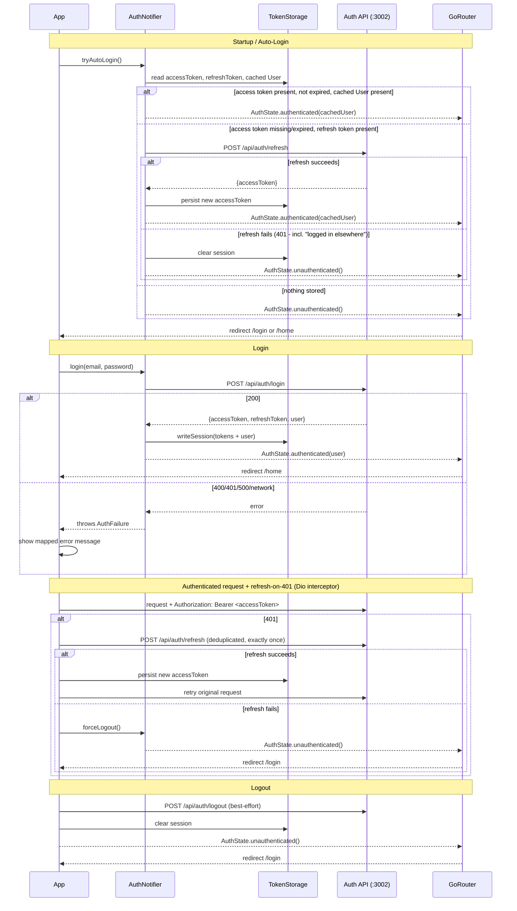

# Implementation Plan: Login Pages for the Flutter App

## Goal Description

Implement the login feature specified in [.docs/specs/app/login.md](file:///home/rjgj/personal_projects/e_invitation/.docs/specs/app/login.md): a login screen in `app/` (currently an untouched `flutter create` scaffold) wired up to the already-implemented JWT REST auth API (`api/routes/auth.ts`). Architecture is locked in per the spec: `dio` (HTTP), `riverpod` (state), `go_router` (routing), `freezed` (data/state classes), `flutter_secure_storage` (token storage), `flutter_dotenv` (API base URL config).

### Architecture Overview



## User Review Required

> [!IMPORTANT]
> **`isAdmin` is deliberately not modeled on the client `User`**: the wire response from `POST /api/auth/login` and the JWT payload both include `isAdmin` (`api/routes/auth.ts`, `api/lib/jwt.ts`), but it's intentionally excluded from the client-side `User` shape — the app has no admin-gated UI in this ticket (or planned), so there's no reason for the client to parse, store, or carry around a privilege flag it never uses. `User.fromJson` simply ignores the extra `isAdmin` key in the response JSON (freezed/json_serializable ignore unrecognized keys by default — no special handling needed).

> [!IMPORTANT]
> **Auto-login caches the full `User`, not just tokens**: the JWT payload has no `name` claim (only `sub`/`email`/`iat`/`exp`), so reconstructing a `User` purely from decoded JWT claims on the "no network call" fast path (spec §8, case 2) would leave `name` blank on the placeholder home screen after a restart. Fix: `TokenStorage.writeSession()` persists the full `User` JSON alongside both tokens at login time; `tryAutoLogin()`'s fast path rehydrates `User.fromJson()` from that cache instead of the JWT claims. `jwt_decoder` is then used only for its originally-intended purpose — checking `exp` via `JwtDecoder.isExpired(accessToken)`.

> [!IMPORTANT]
> **Provider dependency graph — avoid circular init**: `dioProvider`'s 401 interceptor needs to call `authProvider.notifier.forceLogout()` on a terminal refresh failure, but `authProvider` → `authApiProvider` → `dioProvider`, which would be circular if `dioProvider` eagerly `watch`/`read` `authProvider` during its own construction. It doesn't: the interceptor closure captures `ref` and only calls `ref.read(authProvider.notifier)` later, inside the async `onError` callback — well after all providers have finished their initial construction. This is a standard riverpod idiom (capture now, read later) and must be preserved, not "simplified" into an eager `ref.watch` at the top of `dioProvider`'s build function.

> [!WARNING]
> **`API_BASE_URL` differs per target**: Android emulator needs `http://10.0.2.2:3002` (its host-loopback alias), not `localhost`. iOS simulator can use `http://localhost:3002` directly. A physical device needs the host machine's LAN IP. `app/.env` holds one value at a time — switch it manually before running against a different target.

> [!WARNING]
> **Patrol E2E needs a real running API + a seeded test user** — not something this plan automates (per spec §9c). This is a manual/CI precondition, called out again in the Verification Plan below so it isn't missed at implementation time.

## Open Questions

None — architecture (dio/riverpod/go_router/freezed) and scope were already confirmed with the user while authoring `.docs/specs/app/login.md`. The one real gap found while writing this plan (auto-login's fast path needing a cached `User`, not just tokens, since the JWT has no `name` claim) is a correction, not an open decision — addressed directly in "User Review Required" above.

---

## Proposed Changes

### Component 1: Dependencies & Environment

#### [MODIFY] pubspec.yaml

```diff
 environment:
   sdk: ^3.12.2

 dependencies:
   flutter:
     sdk: flutter
   cupertino_icons: ^1.0.8
+  dio: ^5.7.0
+  flutter_riverpod: ^2.6.1
+  go_router: ^14.6.2
+  flutter_secure_storage: ^9.2.2
+  flutter_dotenv: ^5.2.1
+  jwt_decoder: ^2.0.1
+  freezed_annotation: ^2.4.4
+  json_annotation: ^4.9.0

 dev_dependencies:
   flutter_test:
     sdk: flutter
   flutter_lints: ^6.0.0
+  mocktail: ^1.0.4
+  integration_test:
+    sdk: flutter
+  build_runner: ^2.4.13
+  freezed: ^2.5.7
+  json_serializable: ^6.9.0
+  patrol: ^3.15.0

 flutter:
   uses-material-design: true
+  assets:
+    - .env
```

Run `cd app && flutter pub add <packages>` rather than hand-editing versions — the above pins are illustrative; let `flutter pub add` resolve actual current versions.

#### [MODIFY] .gitignore

```diff
+**/.env
```

#### [NEW] .env (gitignored)

```
API_BASE_URL=http://10.0.2.2:3002
```

#### [NEW] .env.example (checked in)

```
API_BASE_URL=
```

---

### Component 2: Config

#### [NEW] lib/config/app_config.dart

```dart
import 'package:flutter_dotenv/flutter_dotenv.dart';
import 'package:flutter_riverpod/flutter_riverpod.dart';

class AppConfig {
  const AppConfig._(this.apiBaseUrl);

  final String apiBaseUrl;

  factory AppConfig.fromEnv() {
    final apiBaseUrl = dotenv.env['API_BASE_URL'];
    if (apiBaseUrl == null || apiBaseUrl.isEmpty) {
      throw StateError('API_BASE_URL is not set in .env');
    }
    return AppConfig._(apiBaseUrl);
  }
}

final appConfigProvider = Provider<AppConfig>((ref) => AppConfig.fromEnv());
```

---

### Component 3: Models

#### [NEW] lib/models/user.dart

```dart
import 'package:freezed_annotation/freezed_annotation.dart';

part 'user.freezed.dart';
part 'user.g.dart';

@freezed
class User with _$User {
  const factory User({
    required String id,
    required String name,
    required String email,
    // isAdmin deliberately not modeled here — see "User Review Required" above.
  }) = _User;

  factory User.fromJson(Map<String, dynamic> json) => _$UserFromJson(json);
}
```

#### [NEW] lib/models/auth_failure.dart

```dart
import 'package:freezed_annotation/freezed_annotation.dart';

part 'auth_failure.freezed.dart';

@freezed
sealed class AuthFailure with _$AuthFailure implements Exception {
  const factory AuthFailure.invalidCredentials() = InvalidCredentialsFailure;
  const factory AuthFailure.validation(String message) = ValidationFailure;
  const factory AuthFailure.network() = NetworkFailure;
  const factory AuthFailure.server() = ServerFailure;
}
```

After creating both files: `dart run build_runner build --delete-conflicting-outputs`, then commit the generated `user.freezed.dart`, `user.g.dart`, `auth_failure.freezed.dart` alongside the source files (generated output is committed, not gitignored — see spec §6).

---

### Component 4: Token Storage

#### [NEW] lib/services/token_storage.dart

```dart
import 'dart:convert';

import 'package:flutter_riverpod/flutter_riverpod.dart';
import 'package:flutter_secure_storage/flutter_secure_storage.dart';

import '../models/user.dart';

abstract class TokenStorage {
  Future<String?> readAccessToken();
  Future<String?> readRefreshToken();
  Future<User?> readUser();
  Future<void> writeSession({
    required String accessToken,
    required String refreshToken,
    required User user,
  });
  Future<void> writeAccessToken(String accessToken);
  Future<void> clear();
}

class SecureTokenStorage implements TokenStorage {
  SecureTokenStorage({FlutterSecureStorage? storage})
      : _storage = storage ?? const FlutterSecureStorage();

  final FlutterSecureStorage _storage;
  static const _accessTokenKey = 'access_token';
  static const _refreshTokenKey = 'refresh_token';
  static const _userKey = 'user';

  @override
  Future<String?> readAccessToken() => _storage.read(key: _accessTokenKey);

  @override
  Future<String?> readRefreshToken() => _storage.read(key: _refreshTokenKey);

  @override
  Future<User?> readUser() async {
    final json = await _storage.read(key: _userKey);
    if (json == null) return null;
    return User.fromJson(jsonDecode(json) as Map<String, dynamic>);
  }

  @override
  Future<void> writeSession({
    required String accessToken,
    required String refreshToken,
    required User user,
  }) async {
    await _storage.write(key: _accessTokenKey, value: accessToken);
    await _storage.write(key: _refreshTokenKey, value: refreshToken);
    await _storage.write(key: _userKey, value: jsonEncode(user.toJson()));
  }

  @override
  Future<void> writeAccessToken(String accessToken) =>
      _storage.write(key: _accessTokenKey, value: accessToken);

  @override
  Future<void> clear() async {
    await _storage.delete(key: _accessTokenKey);
    await _storage.delete(key: _refreshTokenKey);
    await _storage.delete(key: _userKey);
  }
}

final tokenStorageProvider = Provider<TokenStorage>((ref) => SecureTokenStorage());
```

Test double: an in-memory `FakeTokenStorage implements TokenStorage` lives in `test/` (see Component 10), not here.

---

### Component 5: Dio Client & Auth API

#### [NEW] lib/services/api_client.dart

```dart
import 'dart:async';

import 'package:dio/dio.dart';
import 'package:flutter_riverpod/flutter_riverpod.dart';

import '../config/app_config.dart';
import '../models/auth_failure.dart';
import 'token_storage.dart';
// authProvider imported for the lazy `ref.read` inside onError — see
// "Provider dependency graph" note above for why this isn't circular.
import '../providers/auth_provider.dart';

final dioProvider = Provider<Dio>((ref) {
  final config = ref.read(appConfigProvider);
  final tokenStorage = ref.read(tokenStorageProvider);
  final dio = Dio(BaseOptions(baseUrl: config.apiBaseUrl));

  Completer<String?>? refreshCompleter;

  dio.interceptors.add(
    InterceptorsWrapper(
      onRequest: (options, handler) async {
        final isAuthRoute = options.path.contains('/api/auth/login') ||
            options.path.contains('/api/auth/refresh');
        if (!isAuthRoute) {
          final accessToken = await tokenStorage.readAccessToken();
          if (accessToken != null) {
            options.headers['Authorization'] = 'Bearer $accessToken';
          }
        }
        handler.next(options);
      },
      onError: (error, handler) async {
        final isRefreshCall = error.requestOptions.path.contains('/api/auth/refresh');
        final alreadyRetried = error.requestOptions.extra['isRetry'] == true;

        if (error.response?.statusCode != 401 || isRefreshCall || alreadyRetried) {
          return handler.next(error);
        }

        final isFirstToRefresh = refreshCompleter == null;
        refreshCompleter ??= Completer<String?>();

        try {
          String? newAccessToken;
          if (isFirstToRefresh) {
            final refreshToken = await tokenStorage.readRefreshToken();
            if (refreshToken == null) throw const AuthFailure.invalidCredentials();

            final response = await dio.post(
              '/api/auth/refresh',
              data: {'refreshToken': refreshToken},
            );
            newAccessToken = response.data['accessToken'] as String;
            await tokenStorage.writeAccessToken(newAccessToken);
            refreshCompleter!.complete(newAccessToken);
          } else {
            newAccessToken = await refreshCompleter!.future;
          }

          final retryOptions = error.requestOptions
            ..headers['Authorization'] = 'Bearer $newAccessToken'
            ..extra['isRetry'] = true;
          final retryResponse = await dio.fetch(retryOptions);
          return handler.resolve(retryResponse);
        } catch (e) {
          if (isFirstToRefresh) refreshCompleter!.completeError(e);
          await ref.read(authProvider.notifier).forceLogout();
          return handler.next(error);
        } finally {
          if (isFirstToRefresh) refreshCompleter = null;
        }
      },
    ),
  );

  return dio;
});
```

#### [NEW] lib/services/auth_api.dart

```dart
import 'package:dio/dio.dart';
import 'package:flutter_riverpod/flutter_riverpod.dart';

import '../models/auth_failure.dart';
import '../models/user.dart';
import 'api_client.dart';

class AuthApi {
  AuthApi(this._dio);
  final Dio _dio;

  Future<({User user, String accessToken, String refreshToken})> login(
    String email,
    String password,
  ) async {
    try {
      final response = await _dio.post('/api/auth/login', data: {
        'email': email,
        'password': password,
      });
      final data = response.data as Map<String, dynamic>;
      return (
        user: User.fromJson(data['user'] as Map<String, dynamic>),
        accessToken: data['accessToken'] as String,
        refreshToken: data['refreshToken'] as String,
      );
    } on DioException catch (e) {
      throw _mapError(e);
    }
  }

  /// Used by AuthNotifier.tryAutoLogin() and the interceptor's own refresh
  /// call is made directly on `dio`, not through here, to avoid a needless
  /// extra provider hop inside the interceptor closure.
  Future<String> refresh(String refreshToken) async {
    try {
      final response = await _dio.post('/api/auth/refresh', data: {
        'refreshToken': refreshToken,
      });
      return (response.data as Map<String, dynamic>)['accessToken'] as String;
    } on DioException catch (e) {
      throw _mapError(e);
    }
  }

  Future<void> logout(String refreshToken) async {
    try {
      await _dio.post('/api/auth/logout', data: {'refreshToken': refreshToken});
    } on DioException {
      // Best-effort — the API always returns 200 per its contract; ignore failures.
    }
  }

  AuthFailure _mapError(DioException e) {
    final statusCode = e.response?.statusCode;
    if (statusCode == 401) return const AuthFailure.invalidCredentials();
    if (statusCode == 400) {
      final message = (e.response?.data as Map?)?['error'] as String? ?? 'Validation error';
      return AuthFailure.validation(message);
    }
    if (statusCode == 500) return const AuthFailure.server();
    return const AuthFailure.network();
  }
}

final authApiProvider = Provider<AuthApi>((ref) => AuthApi(ref.watch(dioProvider)));
```

Note: `refresh()`'s 401 is mapped to `AuthFailure.invalidCredentials()` for lack of a more specific variant — acceptable because neither of its two callers (the interceptor, `tryAutoLogin()`) inspect the failure's message; both just treat any thrown `AuthFailure` as "refresh failed, force logout."

---

### Component 6: State (riverpod)

Provider dependency graph, construction order (no cycles because `dioProvider`'s `authProvider` reference is read lazily, not during construction — see "User Review Required"):

```
appConfigProvider ─┐
tokenStorageProvider ─┴─▶ dioProvider ─▶ authApiProvider ─▶ authProvider ─▶ loginControllerProvider
                                                                        └─▶ routerProvider
```

#### [NEW] lib/providers/auth_state.dart

```dart
import 'package:freezed_annotation/freezed_annotation.dart';

import '../models/user.dart';

part 'auth_state.freezed.dart';

@freezed
sealed class AuthState with _$AuthState {
  const factory AuthState.unknown() = _Unknown;
  const factory AuthState.authenticated(User user) = _Authenticated;
  const factory AuthState.unauthenticated() = _Unauthenticated;
}
```

Run `build_runner` again after this file exists; commit the generated `auth_state.freezed.dart`.

#### [NEW] lib/providers/auth_provider.dart

```dart
import 'package:flutter_riverpod/flutter_riverpod.dart';
import 'package:jwt_decoder/jwt_decoder.dart';

import '../services/auth_api.dart';
import '../services/token_storage.dart';
import 'auth_state.dart';

class AuthNotifier extends Notifier<AuthState> {
  @override
  AuthState build() => const AuthState.unknown();

  TokenStorage get _tokenStorage => ref.read(tokenStorageProvider);
  AuthApi get _authApi => ref.read(authApiProvider);

  Future<void> login(String email, String password) async {
    final result = await _authApi.login(email, password);
    await _tokenStorage.writeSession(
      accessToken: result.accessToken,
      refreshToken: result.refreshToken,
      user: result.user,
    );
    state = AuthState.authenticated(result.user);
  }

  Future<void> logout() async {
    final refreshToken = await _tokenStorage.readRefreshToken();
    if (refreshToken != null) {
      await _authApi.logout(refreshToken);
    }
    await forceLogout();
  }

  /// Clears the session without an API call — used when the session is
  /// already known-dead (a failed refresh), unlike the public logout()
  /// which best-effort-notifies the server first.
  Future<void> forceLogout() async {
    await _tokenStorage.clear();
    state = const AuthState.unauthenticated();
  }

  Future<void> tryAutoLogin() async {
    final accessToken = await _tokenStorage.readAccessToken();
    final cachedUser = await _tokenStorage.readUser();

    if (accessToken != null && cachedUser != null && !JwtDecoder.isExpired(accessToken)) {
      state = AuthState.authenticated(cachedUser);
      return;
    }

    final refreshToken = await _tokenStorage.readRefreshToken();
    if (refreshToken == null || cachedUser == null) {
      await forceLogout();
      return;
    }

    try {
      final newAccessToken = await _authApi.refresh(refreshToken);
      await _tokenStorage.writeAccessToken(newAccessToken);
      state = AuthState.authenticated(cachedUser);
    } catch (_) {
      await forceLogout();
    }
  }
}

final authProvider = NotifierProvider<AuthNotifier, AuthState>(AuthNotifier.new);
```

#### [NEW] lib/providers/login_controller_provider.dart

```dart
import 'dart:async';

import 'package:flutter_riverpod/flutter_riverpod.dart';

import 'auth_provider.dart';

/// Wraps a single login attempt in AsyncValue (loading/data/error), keeping
/// transient attempt-state out of the long-lived AuthState union — see
/// spec §4's note on why these are kept separate.
class LoginController extends AsyncNotifier<void> {
  @override
  FutureOr<void> build() {}

  Future<void> submit(String email, String password) async {
    state = const AsyncLoading();
    state = await AsyncValue.guard(
      () => ref.read(authProvider.notifier).login(email, password),
    );
  }
}

final loginControllerProvider =
    AsyncNotifierProvider<LoginController, void>(LoginController.new);
```

---

### Component 7: Routing

#### [NEW] lib/providers/router_provider.dart

```dart
import 'package:flutter/foundation.dart';
import 'package:flutter_riverpod/flutter_riverpod.dart';
import 'package:go_router/go_router.dart';

import 'auth_provider.dart';
import 'auth_state.dart';
import '../screens/home_screen.dart';
import '../screens/login_screen.dart';
import '../screens/splash_screen.dart';

class _GoRouterRefreshNotifier extends ChangeNotifier {
  _GoRouterRefreshNotifier(Ref ref) {
    ref.listen(authProvider, (_, __) => notifyListeners());
  }
}

final routerProvider = Provider<GoRouter>((ref) {
  final refreshNotifier = _GoRouterRefreshNotifier(ref);

  return GoRouter(
    initialLocation: '/splash',
    refreshListenable: refreshNotifier,
    routes: [
      GoRoute(path: '/splash', builder: (_, __) => const SplashScreen()),
      GoRoute(path: '/login', builder: (_, __) => const LoginScreen()),
      GoRoute(path: '/home', builder: (_, __) => const HomeScreen()),
    ],
    redirect: (context, state) {
      final authState = ref.read(authProvider);
      final isSplash = state.matchedLocation == '/splash';
      final isLoggingIn = state.matchedLocation == '/login';

      return switch (authState) {
        AuthState_Unknown() => isSplash ? null : '/splash',
        AuthState_Authenticated() => (isSplash || isLoggingIn) ? '/home' : null,
        AuthState_Unauthenticated() => isLoggingIn ? null : '/login',
      };
    },
  );
});
```

Note: the exact generated class names for the `switch` patterns (`AuthState_Unknown` etc.) depend on freezed's naming — verify against the generated `auth_state.freezed.dart` and adjust, or use `authState.when(unknown: ..., authenticated: ..., unauthenticated: ...)` instead of a `switch` if that reads more clearly; both are equivalent, exhaustive, and compiler-checked.

---

### Component 8: Screens

#### [NEW] lib/screens/splash_screen.dart

```dart
import 'package:flutter/material.dart';
import 'package:flutter_riverpod/flutter_riverpod.dart';

import '../providers/auth_provider.dart';

class SplashScreen extends ConsumerStatefulWidget {
  const SplashScreen({super.key});

  @override
  ConsumerState<SplashScreen> createState() => _SplashScreenState();
}

class _SplashScreenState extends ConsumerState<SplashScreen> {
  @override
  void initState() {
    super.initState();
    Future.microtask(() => ref.read(authProvider.notifier).tryAutoLogin());
  }

  @override
  Widget build(BuildContext context) {
    return const Scaffold(body: Center(child: CircularProgressIndicator()));
  }
}
```

#### [NEW] lib/screens/login_screen.dart

```dart
import 'package:flutter/material.dart';
import 'package:flutter_riverpod/flutter_riverpod.dart';

import '../models/auth_failure.dart';
import '../providers/login_controller_provider.dart';

class LoginScreen extends ConsumerStatefulWidget {
  const LoginScreen({super.key});

  @override
  ConsumerState<LoginScreen> createState() => _LoginScreenState();
}

class _LoginScreenState extends ConsumerState<LoginScreen> {
  final _formKey = GlobalKey<FormState>();
  final _emailController = TextEditingController();
  final _passwordController = TextEditingController();

  static final _emailRegex = RegExp(r'^[^@\s]+@[^@\s]+\.[^@\s]+$');

  @override
  void dispose() {
    _emailController.dispose();
    _passwordController.dispose();
    super.dispose();
  }

  Future<void> _submit() async {
    if (!_formKey.currentState!.validate()) return;
    await ref.read(loginControllerProvider.notifier).submit(
          _emailController.text.trim(),
          _passwordController.text,
        );
  }

  String _mapFailure(AuthFailure failure) => failure.when(
        invalidCredentials: () => 'Invalid email or password',
        validation: (_) => 'Please check your email and password and try again.',
        network: () => 'Something went wrong. Please try again.',
        server: () => 'Something went wrong. Please try again.',
      );

  @override
  Widget build(BuildContext context) {
    final loginState = ref.watch(loginControllerProvider);
    final isLoading = loginState.isLoading;

    return Scaffold(
      body: SafeArea(
        child: Padding(
          padding: const EdgeInsets.all(24),
          child: Form(
            key: _formKey,
            child: Column(
              mainAxisAlignment: MainAxisAlignment.center,
              children: [
                TextFormField(
                  key: const Key('login_email_field'),
                  controller: _emailController,
                  enabled: !isLoading,
                  keyboardType: TextInputType.emailAddress,
                  decoration: const InputDecoration(labelText: 'Email'),
                  validator: (value) {
                    if (value == null || value.isEmpty) return 'Email is required';
                    if (!_emailRegex.hasMatch(value)) return 'Enter a valid email address';
                    return null;
                  },
                ),
                const SizedBox(height: 16),
                TextFormField(
                  key: const Key('login_password_field'),
                  controller: _passwordController,
                  enabled: !isLoading,
                  obscureText: true,
                  decoration: const InputDecoration(labelText: 'Password'),
                  validator: (value) {
                    if (value == null || value.isEmpty) return 'Password is required';
                    return null;
                  },
                ),
                const SizedBox(height: 24),
                if (loginState.hasError)
                  Padding(
                    key: const Key('login_error_banner'),
                    padding: const EdgeInsets.only(bottom: 16),
                    child: Text(
                      _mapFailure(loginState.error as AuthFailure),
                      style: TextStyle(color: Theme.of(context).colorScheme.error),
                    ),
                  ),
                ElevatedButton(
                  key: const Key('login_submit_button'),
                  onPressed: isLoading ? null : _submit,
                  child: isLoading
                      ? const SizedBox(
                          height: 20,
                          width: 20,
                          child: CircularProgressIndicator(strokeWidth: 2),
                        )
                      : const Text('Log in'),
                ),
              ],
            ),
          ),
        ),
      ),
    );
  }
}
```

#### [NEW] lib/screens/home_screen.dart

```dart
import 'package:flutter/material.dart';
import 'package:flutter_riverpod/flutter_riverpod.dart';

import '../providers/auth_provider.dart';

class HomeScreen extends ConsumerWidget {
  const HomeScreen({super.key});

  @override
  Widget build(BuildContext context, WidgetRef ref) {
    final authState = ref.watch(authProvider);
    final userName = authState.maybeWhen(
      authenticated: (user) => user.name,
      orElse: () => '',
    );

    return Scaffold(
      appBar: AppBar(title: const Text('Home')),
      body: Center(
        child: Column(
          mainAxisAlignment: MainAxisAlignment.center,
          children: [
            Text('Welcome, $userName'),
            const SizedBox(height: 16),
            ElevatedButton(
              key: const Key('logout_button'),
              onPressed: () => ref.read(authProvider.notifier).logout(),
              child: const Text('Log out'),
            ),
          ],
        ),
      ),
    );
  }
}
```

---

### Component 9: App Entrypoint

#### [MODIFY] lib/main.dart

```dart
import 'package:flutter/material.dart';
import 'package:flutter_dotenv/flutter_dotenv.dart';
import 'package:flutter_riverpod/flutter_riverpod.dart';

import 'providers/router_provider.dart';

Future<void> main() async {
  WidgetsFlutterBinding.ensureInitialized();
  await dotenv.load(fileName: '.env');
  runApp(const ProviderScope(child: MyApp()));
}

class MyApp extends ConsumerWidget {
  const MyApp({super.key});

  @override
  Widget build(BuildContext context, WidgetRef ref) {
    final router = ref.watch(routerProvider);
    return MaterialApp.router(
      title: 'e_invitation',
      theme: ThemeData(colorScheme: ColorScheme.fromSeed(seedColor: Colors.deepPurple)),
      routerConfig: router,
    );
  }
}
```

The stock `MyHomePage` counter widget is removed entirely.

---

### Component 10: Automated Testing

Per spec §9 (Full-stack: unit/widget + Patrol E2E). `mocktail` is new; a `FakeTokenStorage implements TokenStorage` (in-memory `Map`-backed) is a small shared test double worth factoring into `test/fakes/fake_token_storage.dart` since both `auth_provider_test.dart` and any future test need it.

- **`test/services/auth_api_test.dart`**: mock `Dio` (via `DioAdapter`/mocktail); login happy path parses `User`+tokens; 401→`AuthFailure.invalidCredentials()`; 400→`AuthFailure.validation(message)`; 500→`AuthFailure.server()`; timeout/no-connectivity `DioException`→`AuthFailure.network()`; `refresh()` happy path + 401; `logout()` never throws even on a non-200 mocked response. Assert via freezed equality (`expect(failure, const AuthFailure.invalidCredentials())`), not `isA<T>()`.
- **`test/providers/auth_provider_test.dart`**: `login()` success sets `AuthState.authenticated(user)` and calls `FakeTokenStorage.writeSession` with the right args; each failure type leaves state unauthenticated/unchanged and doesn't persist; `tryAutoLogin()` covers all cases: no tokens → unauthenticated; valid cached token+user → authenticated with no `AuthApi.refresh` call (assert the mock was never called); expired token + successful refresh → authenticated, cached user reused; expired token + failed refresh → unauthenticated, storage cleared; `logout()`/`forceLogout()` clear storage and state even when the mocked `AuthApi.logout()` throws.
- **`test/screens/login_screen_test.dart`**: wrap in `ProviderScope(overrides: [loginControllerProvider.overrideWith(...)])` or drive the real controller with a mocked `AuthApi`; renders both fields + submit; empty-field and malformed-email validation block submission, `login()` never called; valid input calls `login()` once; pending state (`AsyncLoading`) disables the submit button and shows a spinner; each `AuthFailure` variant renders its mapped message via `login_error_banner`. Assert all four required `Key`s exist.
- **`integration_test/login_flow_test.dart`** (Patrol): happy path (seeded test user → lands on `HomeScreen` showing their name); wrong-password path (`login_error_banner` shows the exact message, stays on login). Runs against the real API — precondition documented in the Verification Plan below.

---

## Implementation Sequence

| Step | Action | Commit Message |
| ---- | ------ | --------------- |
| 1 | Checkout `feature/app-login` from `dev` | — |
| 2 | `flutter pub add dio flutter_riverpod go_router flutter_secure_storage flutter_dotenv jwt_decoder freezed_annotation json_annotation` | `chore: add auth-related dependencies` |
| 3 | `flutter pub add --dev mocktail integration_test build_runner freezed json_serializable patrol` | `chore: add test and codegen dependencies` |
| 4 | Add `.env`/`.env.example`, `**/.env` to `.gitignore`, declare `.env` as an asset | `chore: add app-level env config for API base URL` |
| 5 | Create `lib/config/app_config.dart` | `feat: add AppConfig for API base URL` |
| 6 | Create `lib/models/user.dart`, `lib/models/auth_failure.dart`; run `build_runner`; commit generated output | `feat: add auth models and failure types` |
| 7 | Create `lib/services/token_storage.dart` | `feat: add secure token storage` |
| 8 | Create `lib/providers/auth_state.dart`; run `build_runner`; commit generated output | `feat: add AuthState union` |
| 9 | Create `lib/providers/auth_provider.dart` (depends on `token_storage.dart`/`auth_api.dart` — create as a placeholder or reorder with step 10 if the implementer prefers strict no-forward-reference ordering) | `feat: add AuthNotifier provider` |
| 10 | Create `lib/services/api_client.dart`, `lib/services/auth_api.dart` | `feat: add Dio client with auth interceptors and auth API` |
| 11 | Create `lib/providers/login_controller_provider.dart` | `feat: add login controller provider` |
| 12 | Create `lib/screens/splash_screen.dart`, `login_screen.dart`, `home_screen.dart` | `feat: add splash, login, and placeholder home screens` |
| 13 | Create `lib/providers/router_provider.dart` | `feat: add app router with auth-gated redirects` |
| 14 | Rewrite `lib/main.dart`; delete `test/widget_test.dart` | `feat: wire up login flow in app entrypoint` |
| 15 | Add the three `test/` files + `test/fakes/fake_token_storage.dart` | `test: add unit and widget tests for login flow` |
| 16 | Run `flutter test`; fix failures | — |
| 17 | `dart pub global activate patrol_cli`; run `patrol bootstrap` | `chore: bootstrap Patrol integration test runner` |
| 18 | Add `integration_test/login_flow_test.dart` | `test: add Patrol E2E tests for login happy/error paths` |
| 19 | Run `patrol test` against a running local API + seeded test user; fix failures | — |
| 20 | Manual verification (below) | — |
| 21 | Push to remote | — |

Note on steps 9–10's ordering: `auth_provider.dart` imports `auth_api.dart` (Component 5) and `auth_api.dart`/`api_client.dart` import `auth_provider.dart` (Component 5's interceptor, Component 6's provider graph note) — this is fine in Dart (no compile-time forward-reference restriction on imports the way some languages have), so the two components can genuinely be written in either order; listed as separate steps only so each commit is reviewable on its own.

## Verification Plan

### Automated Tests

```bash
cd app && flutter test
# Expect: all tests pass across test/services/, test/providers/, test/screens/

cd app && patrol test
# Requires: the API running locally at the configured API_BASE_URL, with a
# known seeded test user in its database (login credentials the E2E test
# uses). This is a real precondition — patrol drives the compiled app
# against the real running API, not a mock, unlike everything in `flutter test`.
```

### Manual Verification

1. **Android emulator** (`API_BASE_URL=http://10.0.2.2:3002` in `.env`): launch app → lands on login → wrong password shows the exact error message and stays on login → correct password lands on the placeholder home screen showing the user's name.
2. **iOS simulator** (`API_BASE_URL=http://localhost:3002`): repeat the same happy/error path checks.
3. **Restart-persistence**: after a successful login, fully kill and relaunch the app → should land directly on the home screen (auto-login), not the login screen.
4. **Logout**: tap the logout button on the home screen → returns to the login screen; relaunching the app afterward should land on login again, not auto-login.
5. **Session invalidation**: log in again with the same account from a second app instance/device (or via a direct `curl` to `/api/auth/login`) → back on the first instance, trigger any authenticated call (or wait for the next natural one) → should silently redirect to `/login` rather than crashing, since the first device's refresh token is now invalid.
