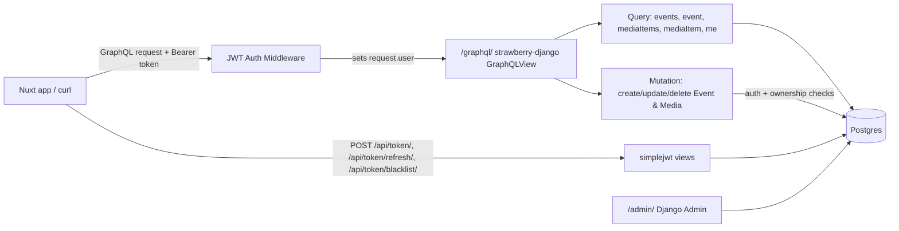

# Implementation Plan: Django API Migration

## Goal Description

Replace the KeystoneJS 6 + Prisma API at `api/` with a fresh Django project (GraphQL-only via `strawberry-django`, JWT auth via `djangorestframework-simplejwt` defaults, Django Admin) against a fresh Postgres DB. No data migration. `Post`/`Tag` boilerplate dropped; only `User`/`Media`/`Event` ported.

Based on the spec at [django-migration.md](file:///home/rjgj/personal/e_invitation/.docs/specs/api/django-migration.md).

### Architecture Overview



## Proposed Changes

### Component 1: Project scaffold, dependencies, settings

#### [NEW] `api/requirements.txt`
```
django
strawberry-graphql-django
djangorestframework
djangorestframework-simplejwt
django-cors-headers
psycopg[binary]
pillow
python-dotenv
pytest-django
```

#### [NEW] `api/manage.py`, `api/config/{__init__,asgi,wsgi}.py`
Standard `django-admin startproject config .` output, no customization needed beyond what `startproject` generates.

#### [NEW] `api/config/settings.py`
- `INSTALLED_APPS`: `django.contrib.admin`, `django.contrib.auth`, `django.contrib.contenttypes`, `django.contrib.sessions` (required by admin), `django.contrib.staticfiles`, `rest_framework`, `rest_framework_simplejwt.token_blacklist`, `corsheaders`, `strawberry_django`, `users`, `media_items`, `events`.
- `AUTH_USER_MODEL = "users.User"`.
- `MIDDLEWARE`: default Django stack + `corsheaders.middleware.CorsMiddleware` (near top, before `CommonMiddleware`) + `core.authentication_middleware.JWTAuthenticationMiddleware` (after `AuthenticationMiddleware`).
- `DATABASES`: built from `DB_HOST`/`DB_PORT`/`DB_NAME`/`DB_USER`/`DB_PASSWORD` env vars (loaded via `python-dotenv` at the top of settings.py), `ENGINE = "django.db.backends.postgresql"`.
- `CORS_ALLOWED_ORIGINS = [os.environ.get("CORS_ORIGIN_DEV", "http://localhost:3000"), "http://localhost"]`, `CORS_ALLOWED_ORIGIN_REGEXES = [r"^capacitor://localhost$"]` (capacitor: scheme isn't a valid entry for `CORS_ALLOWED_ORIGINS`, needs the regex list).
- `REST_FRAMEWORK = {"DEFAULT_AUTHENTICATION_CLASSES": ["rest_framework_simplejwt.authentication.JWTAuthentication"]}`. No `SIMPLE_JWT` override block — library defaults per spec decision.
- `MEDIA_ROOT = BASE_DIR / "media"`, `MEDIA_URL = "/media/"`.
- `SECRET_KEY` from `DJANGO_SECRET_KEY` env var (no fallback — fail loudly if unset), `DEBUG` from `DJANGO_DEBUG` env var.

#### [NEW] `api/.env`, `api/.env.example`
```
DJANGO_SECRET_KEY=
DJANGO_DEBUG=True
APP_PORT=3002
DB_HOST=localhost
DB_PORT=5432
DB_NAME=e_invitation
DB_USER=postgres
DB_PASSWORD=
CORS_ORIGIN_DEV=http://localhost:3000
```
`.env` gets real local values (generate `DJANGO_SECRET_KEY` via `python -c "import secrets; print(secrets.token_urlsafe(50))"`); `.env.example` keeps placeholders.

#### [NEW] `api/.gitignore`
Standard Python/Django ignores: `venv/`, `__pycache__/`, `*.pyc`, `.env`, `media/`, `staticfiles/`.

---

### Component 2: `users` app — custom User model

#### [NEW] `api/users/models.py`
```python
class UserManager(BaseUserManager):
    def create_user(self, email, name, password=None, **extra): ...
    def create_superuser(self, email, name, password=None, **extra): ...  # sets is_staff=is_admin=True

class User(AbstractBaseUser, PermissionsMixin):
    id = models.UUIDField(primary_key=True, default=uuid.uuid4, editable=False)
    email = models.EmailField(unique=True)
    name = models.CharField(max_length=255)
    is_admin = models.BooleanField(default=False)
    is_active = models.BooleanField(default=True)
    is_staff = models.BooleanField(default=False)
    date_joined = models.DateTimeField(auto_now_add=True)
    objects = UserManager()
    USERNAME_FIELD = "email"
    REQUIRED_FIELDS = ["name"]
```
Exact field contract per spec §4.

#### [NEW] `api/users/admin.py`
Register `User` with `UserAdmin`-style config (list_display: email/name/is_admin/is_staff/is_active).

---

### Component 3: `media_items` app — Media model + soft delete

#### [NEW] `api/core/managers.py`
```python
class ActiveManager(models.Manager):
    def get_queryset(self):
        return super().get_queryset().filter(deleted_at__isnull=True)
```
Shared by `Media` and `Event` — single source of truth for the soft-delete filter.

#### [NEW] `api/media_items/models.py`
```python
class Media(models.Model):
    id = models.UUIDField(primary_key=True, default=uuid.uuid4, editable=False)
    image = models.ImageField(upload_to="media/%Y/%m/")
    uploaded_by = models.ForeignKey("users.User", on_delete=models.CASCADE, related_name="media_items")
    created_at = models.DateTimeField(auto_now_add=True)
    deleted_at = models.DateTimeField(null=True, blank=True)
    objects = ActiveManager()
    all_objects = models.Manager()
```

#### [NEW] `api/media_items/admin.py`
Register `Media`, using `all_objects`-backed queryset so soft-deleted rows stay visible/manageable to admins.

---

### Component 4: `events` app — Event model

#### [NEW] `api/events/models.py`
```python
class Event(models.Model):
    TYPE_CHOICES = [("wedding", "Wedding"), ("birthday", "Birthday"), ("baptism", "Baptism")]
    id = models.UUIDField(primary_key=True, default=uuid.uuid4, editable=False)
    author = models.ForeignKey("users.User", on_delete=models.CASCADE, related_name="events")
    title = models.CharField(max_length=255)
    description = models.TextField(blank=True)
    type = models.CharField(max_length=20, choices=TYPE_CHOICES)
    start_date = models.DateTimeField()
    end_date = models.DateTimeField(null=True, blank=True)
    timezone = models.CharField(max_length=64)
    venue_name = models.CharField(max_length=255, blank=True)
    address = models.CharField(max_length=255, blank=True)
    latitude = models.FloatField(null=True, blank=True)
    longitude = models.FloatField(null=True, blank=True)
    cover_image = models.ForeignKey("media_items.Media", on_delete=models.SET_NULL, null=True, blank=True, related_name="cover_of_events")
    gallery = models.ManyToManyField("media_items.Media", blank=True, related_name="gallery_events")
    allow_plus_one = models.BooleanField(default=False)
    rsvp_deadline = models.DateTimeField(null=True, blank=True)
    require_approval = models.BooleanField(default=False)
    primary_color = models.CharField(max_length=32, blank=True)
    secondary_color = models.CharField(max_length=32, blank=True)
    font_family = models.CharField(max_length=128, blank=True)
    created_at = models.DateTimeField(auto_now_add=True)
    updated_at = models.DateTimeField(auto_now=True)
    deleted_at = models.DateTimeField(null=True, blank=True)
    objects = ActiveManager()
    all_objects = models.Manager()
```

#### [NEW] `api/events/admin.py`
Register `Event` (list_display: title/type/author/start_date), same `all_objects` pattern.

**Migrations**: after all three apps' models exist, run `python manage.py makemigrations users media_items events` once (User must migrate first since the other two FK to it — Django's migration graph handles the ordering automatically as long as all three are created before running `makemigrations`).

---

### Component 5: GraphQL schema (strawberry-django)

#### [NEW] `api/media_items/schema.py`
- `@strawberry_django.type(Media)` → `MediaType` (fields: id, image, uploaded_by, created_at — excludes `deleted_at`).
- `media_items() -> list[MediaType]`, `media_item(id) -> MediaType | None` — both query `Media.objects` (soft-delete-filtered manager).
- `create_media(info, image: Upload) -> MediaType` — requires `info.context.request.user.is_authenticated`, else raise; sets `uploaded_by=request.user` unconditionally.
- `update_media(info, id, image: Upload) -> MediaType`, `delete_media(info, id) -> bool` — fetch via `Media.objects`, then check `obj.uploaded_by_id == request.user.id or request.user.is_admin`, else raise permission error; `delete_media` sets `deleted_at=timezone.now()` and saves (no `.delete()`).

#### [NEW] `api/events/schema.py`
Same shape as Media for `EventType`/`events`/`event`/`create_event`/`update_event`/`delete_event`, plus `me() -> UserType | None` returning `request.user` when authenticated (used for the `Query.me` field). Ownership check uses `obj.author_id == request.user.id or request.user.is_admin`. `create_event` forces `author=request.user`; both create/update ignore any client-supplied `author`/`id` in the input type.

Shared permission-check helper (`require_auth(info)`, `require_owner_or_admin(info, obj, owner_field)`) lives in `api/core/permissions.py` to avoid duplicating the same two checks across both apps' mutations.

#### [NEW] `api/core/schema.py`
```python
@strawberry.type
class Query(media_items.schema.Query, events.schema.Query): ...

@strawberry.type
class Mutation(media_items.schema.Mutation, events.schema.Mutation): ...

schema = strawberry.Schema(query=Query, mutation=Mutation)
```

---

### Component 6: JWT authentication middleware

#### [NEW] `api/core/authentication_middleware.py`
```python
class JWTAuthenticationMiddleware:
    def __init__(self, get_response): self.get_response = get_response
    def __call__(self, request):
        auth = JWTAuthentication()
        try:
            result = auth.authenticate(request)
            if result is not None:
                request.user, _ = result
        except (InvalidToken, AuthenticationFailed, TokenError):
            pass  # leave request.user as AnonymousUser (set by Django's AuthenticationMiddleware)
        return self.get_response(request)
```
Placed after `django.contrib.auth.middleware.AuthenticationMiddleware` in `MIDDLEWARE` so it overrides the default session-based `request.user` when a valid Bearer token is present, and falls back cleanly to anonymous otherwise — matches spec §8 error handling exactly (no request-level 401 from the middleware itself).

---

### Component 7: URLs

#### [NEW] `api/config/urls.py`
```python
urlpatterns = [
    path("admin/", admin.site.urls),
    path("graphql/", GraphQLView.as_view(schema=schema, graphiql=settings.DEBUG)),
    path("api/token/", TokenObtainPairView.as_view()),
    path("api/token/refresh/", TokenRefreshView.as_view()),
    path("api/token/blacklist/", TokenBlacklistView.as_view()),
]
if settings.DEBUG:
    urlpatterns += static(settings.MEDIA_URL, document_root=settings.MEDIA_ROOT)
```
`TokenObtainPairView` works against `USERNAME_FIELD = "email"` automatically since it delegates to Django's auth backend — no custom serializer needed for the "simplejwt defaults" decision.

---

### Component 8: Delete old Keystone code

Remove: `api/schema.ts`, `api/schema.graphql`, `api/schema.prisma`, `api/keystone.ts`, `api/auth.ts`, `api/lib/`, `api/routes/`, `api/test/`, `api/schema.test.ts`, `api/vitest.config.ts`, `api/vitest.setup.ts`, `api/package.json`, `api/package-lock.json`, `api/tsconfig.json`, `api/.prettierrc`, `api/.editorconfig`, `api/README.md`, `api/.keystone/`, `api/uploads/`. This must happen **first**, before scaffolding, so the new project starts from a clean `api/` directory.

---

### Component 9: Tests (pytest-django)

#### [NEW] `api/pytest.ini` (or `pyproject.toml` `[tool.pytest.ini_options]`)
```ini
[pytest]
DJANGO_SETTINGS_MODULE = config.settings
python_files = tests.py test_*.py
```

#### [NEW] `api/users/tests.py`
- `create_user`/`create_superuser` set expected defaults, password is hashed not plaintext.

#### [NEW] `api/media_items/tests.py`
- `ActiveManager` excludes soft-deleted rows; `all_objects` includes them.
- GraphQL: anonymous `mediaItems` query returns only non-deleted; `createMedia` requires auth and forces `uploaded_by`; `updateMedia`/`deleteMedia` permission checks (owner/admin/other-user); `deleteMedia` soft-deletes.

#### [NEW] `api/events/tests.py`
- Same pattern as media_items for `Event`, plus `updated_at` changes on save while `created_at` doesn't.

#### [NEW] `api/core/tests.py` (or split into each app as relevant)
- JWT middleware: valid/missing/malformed/expired token behavior (per spec §9a).
- `/api/token/`, `/api/token/refresh/`, `/api/token/blacklist/` happy-path + failure-path tests using DRF's `APIClient`.

Use `strawberry.django.test.GraphQLTestClient` (or a plain Django test `Client` posting to `/graphql/`) for the GraphQL-layer tests, and Django's `TestCase`/`pytest-django`'s `db` fixture for model-layer tests.

---

## Implementation Sequence

| Step | Action | Commit Message |
|---|---|---|
| 1 | Checkout `feature/api-django-migration` from `dev` | — |
| 2 | `git rm -r` old Keystone `api/` contents (Component 8) | `chore: remove keystone api` |
| 3 | `django-admin startproject config .` + `startapp users/media_items/events` inside `api/`, add `requirements.txt`, install into venv | `chore: scaffold django project` |
| 4 | Write `config/settings.py`, `.env`, `.env.example`, `.gitignore` (Component 1) | `chore: configure django settings` |
| 5 | Implement `users/models.py` + `admin.py` (Component 2) | `feat: add custom User model` |
| 6 | Implement `core/managers.py`, `media_items/models.py` + `admin.py` (Component 3) | `feat: add Media model` |
| 7 | Implement `events/models.py` + `admin.py` (Component 4) | `feat: add Event model` |
| 8 | `makemigrations users media_items events`, review migrations | `chore: generate initial migrations` |
| 9 | Implement `core/permissions.py`, `media_items/schema.py`, `events/schema.py`, `core/schema.py` (Component 5) | `feat: add graphql schema` |
| 10 | Implement `core/authentication_middleware.py` (Component 6) | `feat: add jwt auth middleware` |
| 11 | Wire `config/urls.py` (Component 7) | `feat: wire graphql and auth urls` |
| 12 | Create fresh local Postgres DB, `migrate`, `createsuperuser` | — |
| 13 | Add `pytest.ini`, write tests for all apps (Component 9) | `test: add django app test suite` |
| 14 | `cd api && pytest`, fix failures | — |
| 15 | Manual verification (see below) | — |
| 16 | Push to remote **only after explicit user confirmation** | — |

---

## Verification Plan

### Automated Tests
```bash
cd api && pytest
# Expect: all tests pass — users/tests.py, media_items/tests.py, events/tests.py, core/tests.py
```

### Manual Verification
```bash
# 1. Migrations apply clean
cd api && python manage.py migrate

# 2. Server runs on port 3002
python manage.py runserver 0.0.0.0:3002

# 3. Obtain a token pair (after creating a user via createsuperuser or a test fixture)
curl -X POST http://localhost:3002/api/token/ -H "Content-Type: application/json" \
  -d '{"email": "test@example.com", "password": "testpassword"}'
# Expect: 200 {access, refresh}

# 4. Authenticated GraphQL mutation
curl -X POST http://localhost:3002/graphql/ -H "Content-Type: application/json" \
  -H "Authorization: Bearer <access>" \
  -d '{"query": "mutation { createEvent(input: {title: \"Test\", type: \"wedding\", startDate: \"2026-01-01T00:00:00Z\", timezone: \"UTC\"}) { id author { email } } }"}'
# Expect: 200, author.email == the authenticated user's email regardless of any author field attempted in input

# 5. Anonymous query
curl -X POST http://localhost:3002/graphql/ -H "Content-Type: application/json" \
  -d '{"query": "{ events { id title } }"}'
# Expect: 200, returns public non-deleted events, no auth error

# 6. Refresh + blacklist
curl -X POST http://localhost:3002/api/token/refresh/ -d '{"refresh": "<refresh>"}' -H "Content-Type: application/json"
curl -X POST http://localhost:3002/api/token/blacklist/ -d '{"refresh": "<refresh>"}' -H "Content-Type: application/json"
# Then retry refresh with the same token: expect 401

# 7. Django Admin
# Visit http://localhost:3002/admin/, log in with the superuser, confirm User/Media/Event are manageable
```

### Post-approval durable artifact
Once this plan is approved, write this same content to `.docs/plans/django-migration-plan.md` (the durable deliverable per `CLAUDE.md`'s workflow) before starting implementation.
