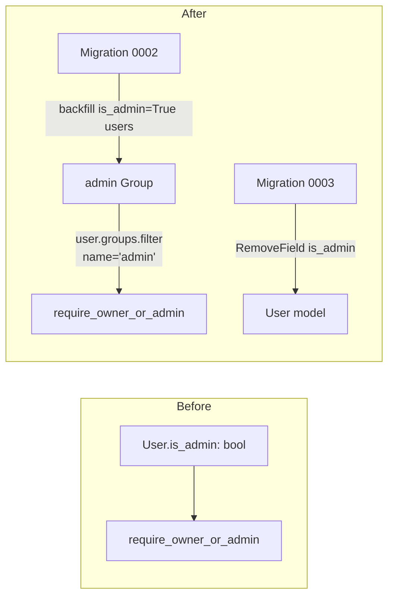

# Implementation Plan: Group-Based Authorization

## Goal Description

Replace `User.is_admin` with Django's built-in Groups (`"admin"` group) as the authorization mechanism for the owner-or-admin bypass on `Event`/`Media` mutations. GraphQL `UserType` drops `is_admin`, adds `groups: list[str]`.

Based on the spec at [group-authorization.md](file:///home/rjgj/personal/e_invitation/.docs/specs/api/group-authorization.md).

### Architecture Overview



## Proposed Changes

### Component 1: Migrations

#### [NEW] `api/users/migrations/0002_create_admin_group.py`
Data migration — creates the `"admin"` group and backfills current `is_admin=True` users into it, run **before** the field is removed so no data is lost.
```python
from django.db import migrations


def create_admin_group_and_backfill(apps, schema_editor):
    Group = apps.get_model("auth", "Group")
    User = apps.get_model("users", "User")
    admin_group, _ = Group.objects.get_or_create(name="admin")
    for user in User.objects.filter(is_admin=True):
        user.groups.add(admin_group)


def reverse(apps, schema_editor):
    Group = apps.get_model("auth", "Group")
    Group.objects.filter(name="admin").delete()


class Migration(migrations.Migration):
    dependencies = [
        ("users", "0001_initial"),
        ("auth", "0012_alter_user_first_name_max_length"),
    ]
    operations = [
        migrations.RunPython(create_admin_group_and_backfill, reverse),
    ]
```

#### [NEW] `api/users/migrations/0003_remove_user_is_admin.py`
Generated via `makemigrations` after Component 2's model change: `migrations.RemoveField(model_name="user", name="is_admin")`.

**Sequencing is load-bearing**: 0002 must run and commit before 0003 drops the column, otherwise the backfill query (`User.objects.filter(is_admin=True)`) has nothing to read.

---

### Component 2: Model & manager

#### [MODIFY] `api/users/models.py`
```diff
     is_admin = models.BooleanField(default=False)
-    is_active = models.BooleanField(default=True)
+    is_active = models.BooleanField(default=True)
```
(i.e. remove the `is_admin` line entirely)

```diff
     def create_user(self, email, name, password=None, **extra_fields):
-        extra_fields.setdefault("is_admin", False)
         extra_fields.setdefault("is_staff", False)
         return self._create_user(email, name, password, **extra_fields)

     def create_superuser(self, email, name, password=None, **extra_fields):
-        extra_fields.setdefault("is_admin", True)
         extra_fields.setdefault("is_staff", True)
         extra_fields.setdefault("is_superuser", True)
-        return self._create_user(email, name, password, **extra_fields)
+        user = self._create_user(email, name, password, **extra_fields)
+        admin_group, _ = Group.objects.get_or_create(name="admin")
+        user.groups.add(admin_group)
+        return user
```
Add `from django.contrib.auth.models import Group` import.

---

### Component 3: Authorization check

#### [MODIFY] `api/core/permissions.py`
```diff
 def require_owner_or_admin(info, obj, owner_field):
     user = require_auth(info)
     owner_id = getattr(obj, f"{owner_field}_id")
-    if owner_id != user.id and not user.is_admin:
+    if owner_id != user.id and not user.groups.filter(name="admin").exists():
         raise Exception("Permission denied")
     return user
```

---

### Component 4: GraphQL schema

#### [MODIFY] `api/users/schema.py`
```diff
 @strawberry.type
 class UserType:
     id: strawberry.ID
     email: str
     name: str
-    is_admin: bool
+    groups: list[str]

     @staticmethod
     def from_model(user: User) -> "UserType":
         return UserType(
             id=strawberry.ID(str(user.id)),
             email=user.email,
             name=user.name,
-            is_admin=user.is_admin,
+            groups=list(user.groups.values_list("name", flat=True)),
         )
```

---

### Component 5: Django Admin

#### [MODIFY] `api/users/admin.py`
```diff
-    list_display = ["email", "name", "is_admin", "is_staff", "is_active"]
-    list_filter = ["is_admin", "is_staff", "is_active"]
+    list_display = ["email", "name", "is_staff", "is_active"]
+    list_filter = ["is_staff", "is_active"]
     ...
             "Permissions",
             {
                 "fields": (
-                    "is_admin",
                     "is_active",
                     "is_staff",
                     "is_superuser",
                     "groups",
                     "user_permissions",
                 )
             },
```

---

### Component 6: Tests

#### [MODIFY] `api/conftest.py`
```diff
+from django.contrib.auth.models import Group
+
 @pytest.fixture
-def make_user(db):
-    def _make_user(email="user@example.com", name="User", is_admin=False):
-        return User.objects.create_user(email=email, name=name, password="pw12345", is_admin=is_admin)
+def make_user(db):
+    def _make_user(email="user@example.com", name="User"):
+        return User.objects.create_user(email=email, name=name, password="pw12345")

     return _make_user

 ...

 @pytest.fixture
 def admin_user(make_user):
-    return make_user(email="admin@example.com", name="Admin", is_admin=True)
+    user = make_user(email="admin@example.com", name="Admin")
+    group, _ = Group.objects.get_or_create(name="admin")
+    user.groups.add(group)
+    return user
```

#### [MODIFY] `api/users/tests.py`
```diff
 def test_create_user_defaults():
     user = User.objects.create_user(email="a@example.com", name="A", password="pw12345")
-    assert user.is_admin is False
     assert user.is_staff is False
     assert user.is_active is True
     ...

 def test_create_superuser_defaults():
     user = User.objects.create_superuser(email="admin@example.com", name="Admin", password="pw12345")
-    assert user.is_admin is True
     assert user.is_staff is True
     assert user.is_superuser is True
+    assert user.groups.filter(name="admin").exists()
```

#### [MODIFY] `api/media_items/tests.py`, `api/events/tests.py`
No code changes needed in `test_update_media_allows_admin`/`test_update_event_allows_admin` themselves — they already just consume the `admin_user` fixture, which now grants admin via group membership instead of the flag. Re-run to confirm they still pass.

---

## Implementation Sequence

| Step | Action | Commit Message |
|---|---|---|
| 1 | Checkout `feature/api-group-authorization` from `dev` | — |
| 2 | Write `users/migrations/0002_create_admin_group.py`, run `migrate users 0002` | `feat: create admin group and backfill from is_admin` |
| 3 | Verify existing superuser landed in `"admin"` group via `manage.py shell` | — |
| 4 | Modify `users/models.py` (Component 2) | `refactor: replace is_admin field with admin group` |
| 5 | `makemigrations` → review `0003_remove_user_is_admin.py` → `migrate` | `chore: remove is_admin field` |
| 6 | Modify `core/permissions.py` (Component 3) | `feat: check admin group membership in permissions` |
| 7 | Modify `users/schema.py` (Component 4) | `feat: expose groups instead of isAdmin in graphql` |
| 8 | Modify `users/admin.py` (Component 5) | `chore: remove is_admin from django admin` |
| 9 | Modify `conftest.py`, `users/tests.py` (Component 6) | `test: update fixtures and tests for group auth` |
| 10 | `cd api && pytest`, fix any failures | — |
| 11 | Manual verification (see below) | — |
| 12 | Push to remote **only after explicit user confirmation** | — |

---

## Verification Plan

### Automated Tests
```bash
cd api && pytest
# Expect: all tests pass, including test_update_media_allows_admin / test_update_event_allows_admin
```

### Manual Verification
```bash
# 1. Migrations apply clean, superuser backfilled into admin group
python manage.py migrate
python manage.py shell -c "
from users.models import User
u = User.objects.get(email='jaictinrj@gmail.com')
print(list(u.groups.values_list('name', flat=True)))
"
# Expect: ['admin']

# 2. GraphQL me query — groups present, isAdmin gone
python manage.py runserver 0.0.0.0:3002 &
ACCESS=$(curl -s -X POST http://localhost:3002/api/token/ -H "Content-Type: application/json" \
  -d '{"email": "jaictinrj@gmail.com", "password": "admin123"}' | python3 -c "import json,sys; print(json.load(sys.stdin)['access'])")
curl -s -X POST http://localhost:3002/graphql/ -H "Content-Type: application/json" -H "Authorization: Bearer $ACCESS" \
  -d '{"query": "{ me { email groups } }"}'
# Expect: {"data": {"me": {"email": "jaictinrj@gmail.com", "groups": ["admin"]}}}
# Expect: a query requesting `isAdmin` fails schema validation (field no longer exists)

# 3. Non-admin non-owner still denied (regression) — covered by existing automated tests, no new manual step needed

# 4. Stop dev server when done
```

### Post-approval durable artifact
Once approved, write this same content to `.docs/plans/group-authorization-plan.md` before starting implementation.
