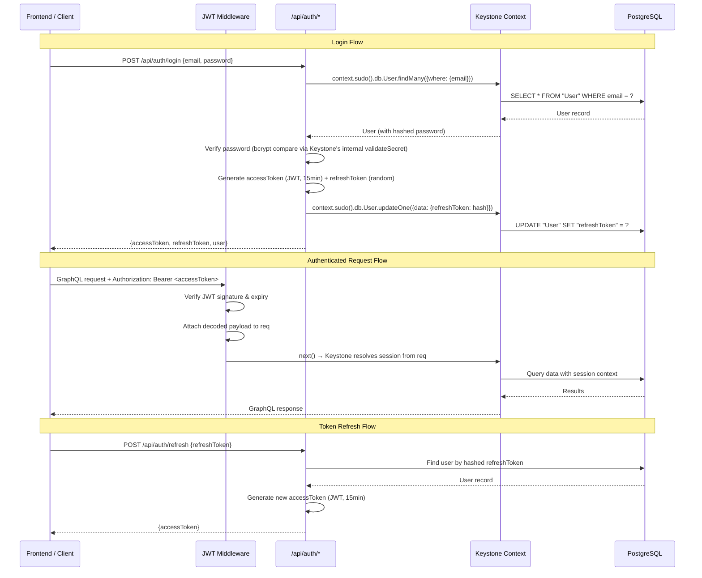

# Implementation Plan: JWT Authentication for KeystoneJS API

## Goal Description

Add JWT-based authentication to the KeystoneJS API (`api/`) so that external clients (the `app` frontend, future mobile clients) can authenticate via stateless tokens instead of cookies. The existing cookie-based Admin UI auth must remain fully functional.

Based on the spec at [jwt-auth.md](file:///home/rjgj/personal_projects/e_invitation/.docs/specs/api/jwt-auth.md).

### Architecture Overview



## User Review Required

> [!IMPORTANT]
> **Single-device refresh tokens**: The spec stores one refresh token per user. Logging in on a second device will invalidate the first device's refresh token. If multi-device support is needed, this requires a separate `RefreshToken` list (deferred per spec).

> [!IMPORTANT]
> **Password verification approach**: Keystone doesn't expose its internal bcrypt compare function directly. The plan uses the `authenticateUserWithPassword` GraphQL mutation internally (via `context.graphql.raw`) to validate credentials, which is the sanctioned Keystone approach. This avoids reaching into Prisma internals.

> [!WARNING]
> **SESSION_SECRET missing from `.env`**: The current `.env` has no `SESSION_SECRET` entry, but `auth.ts` references `process.env.SESSION_SECRET`. This should be added alongside the JWT secrets.

## Open Questions

> [!IMPORTANT]
> **Access token expiry duration** — The spec sets 15 minutes. Confirm this is acceptable for your use case. Shorter = more secure but more refresh calls. ANSWER: 24 hours.

---

## Proposed Changes

### Component 1: Dependencies & Environment

#### [MODIFY] package.json

Install `jsonwebtoken` for token signing/verification.

```bash
cd api && npm install jsonwebtoken && npm install -D @types/jsonwebtoken
```

#### [MODIFY] .env

Add JWT secrets (values generated at implementation time):

```diff
 APP_PORT=3002
 DB_HOST=localhost
 DB_PORT=5432
 DB_NAME=rj_e_invitation_dev
 DB_USER=admin
 DB_PASSWORD=admin123
-1
+SESSION_SECRET=<generated-64-char-hex>
+JWT_SECRET=<generated-64-char-hex>
+JWT_REFRESH_SECRET=<generated-64-char-hex>
```

#### [MODIFY] .env.example

Add placeholder entries so other developers know which vars to set:

```
APP_PORT=3002
DB_HOST=localhost
DB_PORT=5432
DB_NAME=
DB_USER=
DB_PASSWORD=
SESSION_SECRET=
JWT_SECRET=
JWT_REFRESH_SECRET=
```

---

### Component 2: JWT Utility Library

#### [NEW] lib/jwt.ts

Centralizes all JWT operations. Keeps token logic out of route handlers.

```typescript
import jwt from "jsonwebtoken";
import { randomBytes, createHash } from "node:crypto";

import dotenv from "dotenv";
dotenv.config({ path: ".env" });

const JWT_SECRET = process.env.JWT_SECRET;
const JWT_REFRESH_SECRET = process.env.JWT_REFRESH_SECRET;

if (!JWT_SECRET || !JWT_REFRESH_SECRET) {
  throw new Error(
    "FATAL: JWT_SECRET and JWT_REFRESH_SECRET must be set in environment variables.",
  );
}

export interface JwtPayload {
  sub: string;
  email: string;
  isAdmin: boolean;
  iat: number;
  exp: number;
}

const ACCESS_TOKEN_EXPIRY = "15m";

/**
 * Signs a JWT access token with user claims.
 */
export function generateAccessToken(user: {
  id: string;
  email: string;
  isAdmin: boolean;
}): string {
  return jwt.sign(
    {
      sub: user.id,
      email: user.email,
      isAdmin: user.isAdmin,
    },
    JWT_SECRET!,
    { expiresIn: ACCESS_TOKEN_EXPIRY },
  );
}

/**
 * Generates a cryptographically random opaque refresh token.
 */
export function generateRefreshToken(): string {
  return randomBytes(40).toString("hex");
}

/**
 * Verifies and decodes a JWT access token.
 * Throws if the token is expired or has an invalid signature.
 */
export function verifyAccessToken(token: string): JwtPayload {
  return jwt.verify(token, JWT_SECRET!) as JwtPayload;
}

/**
 * SHA-256 hashes a refresh token before storage.
 * Prevents a DB leak from exposing usable tokens.
 */
export function hashToken(token: string): string {
  return createHash("sha256").update(token).digest("hex");
}
```

---

### Component 3: Auth Route Handlers

#### [NEW] routes/auth.ts

Express router with three endpoints. Uses `context.sudo()` to bypass access control for internal auth operations.

```typescript
import { Router, type Request, type Response } from "express";
import {
  generateAccessToken,
  generateRefreshToken,
  hashToken,
} from "../lib/jwt";

import type { Context } from ".keystone/types";

export function createAuthRouter(commonContext: Context) {
  const router = Router();

  // Middleware to parse JSON bodies on auth routes
  router.use(require("express").json());

  /**
   * POST /api/auth/login
   * Validates credentials, returns access + refresh tokens.
   */
  router.post("/login", async (req: Request, res: Response) => {
    const { email, password } = req.body;

    if (!email || !password) {
      return res.status(400).json({ error: "Email and password are required" });
    }

    try {
      // Use Keystone's built-in authentication to validate credentials
      const result = await commonContext.graphql.raw({
        query: `
          mutation($email: String!, $password: String!) {
            authenticateUserWithPassword(email: $email, password: $password) {
              ... on UserAuthenticationWithPasswordSuccess {
                item {
                  id
                  name
                  email
                  isAdmin
                }
              }
              ... on UserAuthenticationWithPasswordFailure {
                message
              }
            }
          }
        `,
        variables: { email, password },
      });

      const authResult = result.data?.authenticateUserWithPassword;

      if (!authResult?.item) {
        return res.status(401).json({ error: "Invalid email or password" });
      }

      const user = authResult.item;

      // Generate tokens
      const accessToken = generateAccessToken(user);
      const refreshToken = generateRefreshToken();
      const hashedRefreshToken = hashToken(refreshToken);

      // Store hashed refresh token on the user
      const sudoContext = commonContext.sudo();
      await sudoContext.db.User.updateOne({
        where: { id: user.id },
        data: { refreshToken: hashedRefreshToken },
      });

      return res.status(200).json({
        accessToken,
        refreshToken,
        user: {
          id: user.id,
          name: user.name,
          email: user.email,
          isAdmin: user.isAdmin,
        },
      });
    } catch (error) {
      console.error("Login error:", error);
      return res.status(500).json({ error: "Internal server error" });
    }
  });

  /**
   * POST /api/auth/refresh
   * Accepts a refresh token, returns a new access token.
   */
  router.post("/refresh", async (req: Request, res: Response) => {
    const { refreshToken } = req.body;

    if (!refreshToken) {
      return res.status(400).json({ error: "Refresh token is required" });
    }

    try {
      const hashedToken = hashToken(refreshToken);
      const sudoContext = commonContext.sudo();

      // Find user with matching hashed refresh token
      const users = await sudoContext.db.User.findMany({
        where: { refreshToken: { equals: hashedToken } },
      });

      if (users.length === 0) {
        return res
          .status(401)
          .json({ error: "Invalid or expired refresh token" });
      }

      const user = users[0];

      // Generate a new access token
      const accessToken = generateAccessToken({
        id: user.id,
        email: user.email,
        isAdmin: user.isAdmin,
      });

      return res.status(200).json({ accessToken });
    } catch (error) {
      console.error("Refresh error:", error);
      return res.status(500).json({ error: "Internal server error" });
    }
  });

  /**
   * POST /api/auth/logout
   * Clears the refresh token, invalidating future refresh attempts.
   */
  router.post("/logout", async (req: Request, res: Response) => {
    const { refreshToken } = req.body;

    if (!refreshToken) {
      return res.status(400).json({ error: "Refresh token is required" });
    }

    try {
      const hashedToken = hashToken(refreshToken);
      const sudoContext = commonContext.sudo();

      // Find user and clear their refresh token
      const users = await sudoContext.db.User.findMany({
        where: { refreshToken: { equals: hashedToken } },
      });

      if (users.length > 0) {
        await sudoContext.db.User.updateOne({
          where: { id: users[0].id },
          data: { refreshToken: null },
        });
      }

      // Always return success (don't reveal if the token was valid)
      return res.status(200).json({ success: true });
    } catch (error) {
      console.error("Logout error:", error);
      return res.status(500).json({ error: "Internal server error" });
    }
  });

  return router;
}
```

---

### Component 4: JWT Middleware

#### [NEW] lib/auth-middleware.ts

Express middleware that reads the `Authorization: Bearer` header, verifies the JWT, and attaches decoded session data to the request for Keystone to consume.

```typescript
import type { Request, Response, NextFunction } from "express";
import { verifyAccessToken, type JwtPayload } from "./jwt";
import { TokenExpiredError, JsonWebTokenError } from "jsonwebtoken";

// Extend Express Request to carry JWT session data
declare global {
  namespace Express {
    interface Request {
      jwtPayload?: JwtPayload;
    }
  }
}

// Paths that should skip JWT verification entirely
const SKIP_PATHS = ["/api/auth/login", "/api/auth/refresh", "/api/auth/logout"];

/**
 * Middleware that extracts and verifies JWT from the Authorization header.
 *
 * - If no Authorization header is present: continues as anonymous (no error).
 * - If token is valid: attaches decoded payload to req.jwtPayload.
 * - If token is expired or invalid: returns 401.
 */
export function jwtAuthMiddleware(
  req: Request,
  res: Response,
  next: NextFunction,
) {
  // Skip auth routes and Admin UI paths
  if (
    SKIP_PATHS.some((p) => req.path.startsWith(p)) ||
    req.path.startsWith("/_next") ||
    req.path === "/"
  ) {
    return next();
  }

  const authHeader = req.headers.authorization;

  // No header → anonymous access (let Keystone access control decide)
  if (!authHeader) {
    return next();
  }

  // Malformed header → still allow through as anonymous
  if (!authHeader.startsWith("Bearer ")) {
    return next();
  }

  const token = authHeader.slice(7);

  try {
    const payload = verifyAccessToken(token);
    req.jwtPayload = payload;
    return next();
  } catch (error) {
    if (error instanceof TokenExpiredError) {
      return res.status(401).json({ error: "Token expired" });
    }
    if (error instanceof JsonWebTokenError) {
      return res.status(401).json({ error: "Invalid token" });
    }
    return res.status(401).json({ error: "Authentication failed" });
  }
}
```

---

### Component 5: Schema Update

#### [MODIFY] schema.ts

Add `refreshToken` field to the `User` list. Hidden from all Admin UI views.

```diff
 // in the User list fields:
     isAdmin: checkbox(),
+
+    refreshToken: text({
+      ui: {
+        itemView: { fieldMode: 'hidden' },
+        listView: { fieldMode: 'hidden' },
+        createView: { fieldMode: 'hidden' },
+      },
+      db: { isNullable: true },
+    }),
   },
 }),
```

This will trigger a Prisma migration adding a nullable `refreshToken` text column to the `User` table.

---

### Component 6: Keystone Configuration

#### [MODIFY] keystone.ts

Wire the JWT middleware and auth routes into the Express app via `server.extendExpressApp`. Also set up session resolution from JWT payload.

```diff
 import { config } from '@keystone-6/core'
 import { lists } from './schema'
 import { withAuth, session } from './auth'
+import { jwtAuthMiddleware } from './lib/auth-middleware'
+import { createAuthRouter } from './routes/auth'

 import dotenv from 'dotenv'
 dotenv.config({ path: '.env' })

 export default withAuth(
   config({
     server: {
       port: Number.parseInt(process.env.APP_PORT || '3000'),
+      extendExpressApp: (app, commonContext) => {
+        // Mount JWT verification middleware
+        app.use(jwtAuthMiddleware)
+
+        // Mount auth REST routes
+        app.use('/api/auth', createAuthRouter(commonContext))
+      },
     },
     db: {
       provider: 'postgresql',
       ...
     },
     lists,
     session,
   }),
 )
```

#### [MODIFY] auth.ts

Update the session strategy to also resolve sessions from JWT payloads (via `req.jwtPayload`) in addition to cookies.

```diff
-const session = statelessSessions({
-  maxAge: sessionMaxAge,
-  secret: process.env.SESSION_SECRET,
-})
+// Custom session strategy that supports both cookie-based sessions (Admin UI)
+// and JWT-based sessions (API clients)
+const session = {
+  ...statelessSessions({
+    maxAge: sessionMaxAge,
+    secret: process.env.SESSION_SECRET,
+  }),
+  get: async ({ context }: { context: any }) => {
+    // First try the default cookie-based session
+    const cookieSession = await statelessSessions({
+      maxAge: sessionMaxAge,
+      secret: process.env.SESSION_SECRET,
+    }).get({ context })
+
+    if (cookieSession) return cookieSession
+
+    // Fall back to JWT payload if present on the request
+    const jwtPayload = context.req?.jwtPayload
+    if (jwtPayload) {
+      return {
+        itemId: jwtPayload.sub,
+        data: { isAdmin: jwtPayload.isAdmin },
+        listKey: 'User',
+      }
+    }
+
+    return undefined
+  },
+}
```

> [!IMPORTANT]
> The session integration approach above is a **simplified illustration**. The actual Keystone `statelessSessions` API returns an object with `get`, `start`, and `end` methods. The implementation will need to spread the original session object and override only `get` to check `req.jwtPayload` as a fallback. I'll verify the exact API surface during implementation.

---

## Implementation Sequence

| Step | Action                                                           | Commit Message                                    |
| ---- | ---------------------------------------------------------------- | ------------------------------------------------- |
| 1    | Checkout `feature/jwt-auth` from `dev`                           | —                                                 |
| 2    | `npm install jsonwebtoken && npm install -D @types/jsonwebtoken` | `chore: add jsonwebtoken dependency`              |
| 3    | Add env vars to `.env` and `.env.example`                        | `chore: add JWT secret env variables`             |
| 4    | Create `api/lib/jwt.ts`                                          | `feat: add JWT utility library`                   |
| 5    | Add `refreshToken` field to User in `api/schema.ts`              | `feat: add refreshToken field to User schema`     |
| 6    | Create `api/routes/auth.ts`                                      | `feat: add JWT auth REST endpoints`               |
| 7    | Create `api/lib/auth-middleware.ts`                              | `feat: add JWT auth middleware`                   |
| 8    | Modify `api/keystone.ts` to mount middleware + routes            | `feat: wire JWT middleware into Keystone server`  |
| 9    | Modify `api/auth.ts` to resolve JWT sessions                     | `feat: extend session strategy with JWT fallback` |
| 10   | Run `keystone dev` to apply Prisma migration                     | `chore: apply refreshToken migration`             |
| 11   | Test all endpoints with `curl`                                   | —                                                 |
| 12   | Push to remote                                                   | —                                                 |

---

## Verification Plan

### Automated Tests

```bash
# Verify the project compiles
cd api && npx keystone build
```

### Manual Verification

**1. Login — valid credentials:**

```bash
curl -X POST http://localhost:3002/api/auth/login \
  -H "Content-Type: application/json" \
  -d '{"email": "test@example.com", "password": "testpassword"}'
# Expected: 200 with {accessToken, refreshToken, user}
```

**2. Login — invalid credentials:**

```bash
curl -X POST http://localhost:3002/api/auth/login \
  -H "Content-Type: application/json" \
  -d '{"email": "test@example.com", "password": "wrong"}'
# Expected: 401 with {error: "Invalid email or password"}
```

**3. Authenticated GraphQL query:**

```bash
curl -X POST http://localhost:3002/api/graphql \
  -H "Content-Type: application/json" \
  -H "Authorization: Bearer <accessToken>" \
  -d '{"query": "{ authenticatedItem { ... on User { id email } } }"}'
# Expected: Returns the authenticated user
```

**4. Unauthenticated GraphQL query (no header):**

```bash
curl -X POST http://localhost:3002/api/graphql \
  -H "Content-Type: application/json" \
  -d '{"query": "{ authenticatedItem { ... on User { id email } } }"}'
# Expected: Returns null (no 401 error)
```

**5. Token refresh:**

```bash
curl -X POST http://localhost:3002/api/auth/refresh \
  -H "Content-Type: application/json" \
  -d '{"refreshToken": "<refreshToken-from-login>"}'
# Expected: 200 with {accessToken}
```

**6. Logout:**

```bash
curl -X POST http://localhost:3002/api/auth/logout \
  -H "Content-Type: application/json" \
  -d '{"refreshToken": "<refreshToken-from-login>"}'
# Expected: 200 with {success: true}
# Then refresh should fail with 401
```

**7. Admin UI still works:**

- Navigate to `http://localhost:3002` in browser
- Log in via the Admin UI form
- Verify cookie-based session works as before

**8. Expired token:**

- Wait 15 minutes (or temporarily set expiry to `5s` for testing)
- Retry a GraphQL request with the old token
- Expected: `401 {error: "Token expired"}`
